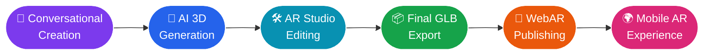
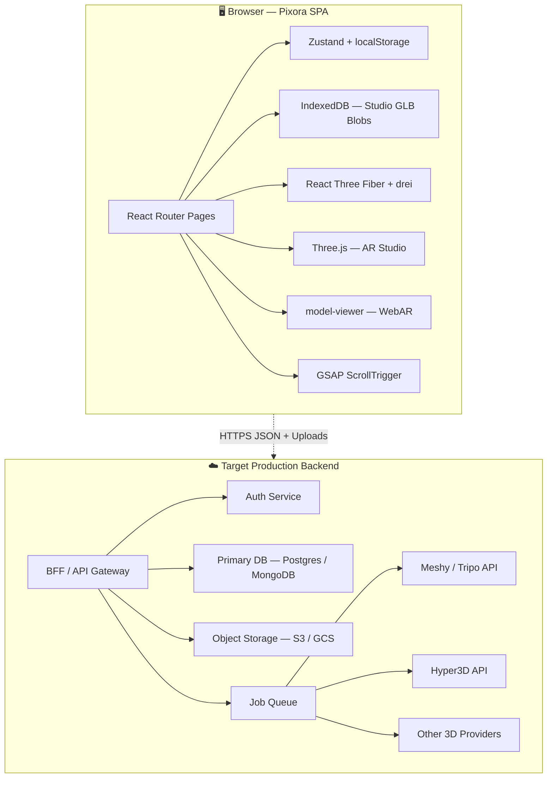
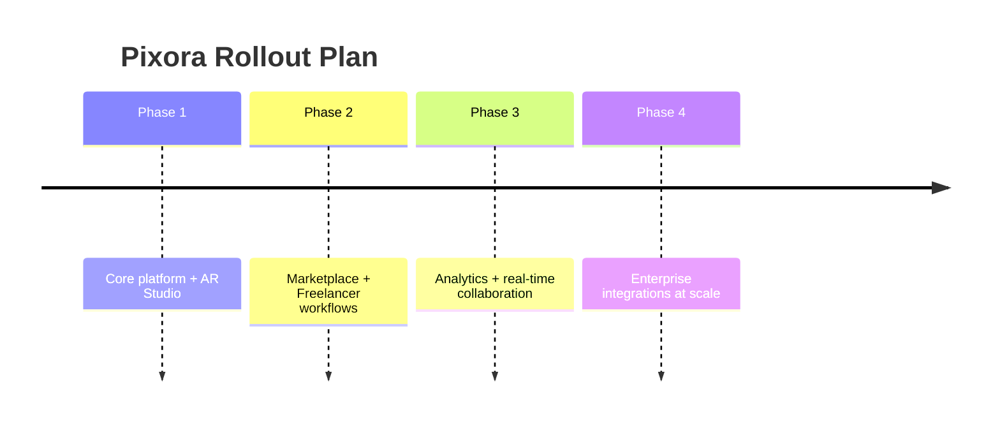

<div align="center">


<a href="#"></a>

<br/>


<h3>🚀 <a href="#">Live Demo</a> &nbsp;|&nbsp; 🎥 <a href="#">Watch the Pitch</a> &nbsp;|&nbsp; 📦 <a href="#">GitHub Repo</a> &nbsp;|&nbsp; 🧭 <a href="#">Architecture Docs</a></h3>

</div>

<br/>

## 🪄 What is Pixora?

> **Pixora** turns a sentence — or a single photo — into a **production-ready 3D model** you can edit right in your browser and **beam into the real world via WebAR**, in minutes, with zero installs and zero Blender tutorials.

<div align="center">

```
   💬 "a modern wooden armchair with cushions"
              │
              ▼
   🤖  AI 3D GENERATION  (Text-to-3D / Image-to-3D)
              │
              ▼
   🛠️  BROWSER AR STUDIO  (move · rotate · scale · brand it)
              │
              ▼
   📱  WEBAR PUBLISHING  (QR code · shareable link)
              │
              ▼
   ✨  YOUR PRODUCT, LIFE-SIZE, IN SOMEONE'S LIVING ROOM
```

</div>

**One idea → one platform → one shareable AR experience.** No specialist software. No physical prototypes. No five different tools stitched together with duct tape.

---

## 😩 The Problem

<table>
<tr>
<td width="50%" valign="top">

### The old way is broken
- 🧱 Blender / Maya / Unreal → powerful, but slow, expensive, **not beginner-friendly**
- 🧵 4–5 disconnected tools just to go from *idea* → *editable* → *hosted* → *published*
- 📵 No easy way for a customer to check a 3D model on **their own device**
- 🧑‍🎨 Human 3D modelers are in high demand but painfully limited supply
- 🖼️ Flat product photos never show real-world scale or fit

</td>
<td width="50%" valign="top">

### Why existing tools stop short
- AI image generators **stop at a flat image**
- Text-to-3D tools **stop at generation** — no editing, no AR, no sharing
- Professional 3D suites are **overkill** for a marketing team or solo founder
- Every stage — creation, editing, hosting, AR, commerce — lives in a **different product**

</td>
</tr>
</table>

<div align="center">

### 🧨 If product creation stays fragmented, businesses lose **time, money, and customer confidence.**

</div>

---

## 💡 The Pixora Fix

<div align="center">



</div>

| ⚡ Faster Creation | 🌐 Zero Install | 📦 Production-Ready | 🔗 Instant Sharing | 🕶️ Real AR |
|:---:|:---:|:---:|:---:|:---:|
| Idea → 3D in minutes | Runs entirely in-browser | Optimized, exportable GLB | QR code or shareable link | True-to-scale product previews |

---

## 🧩 Core Capabilities

<table>
<tr>
<td width="33%" valign="top">

### 🎨 Creation Engine
- AI 3D Generation
- Text-to-3D
- Image-to-3D
- GLB Generation

</td>
<td width="33%" valign="top">

### 🛠️ AR Studio
- Load & transform GLB models
- Move · rotate · scale
- Add logos & extra 3D assets
- Live scene preview + export

</td>
<td width="33%" valign="top">

### 📡 WebAR & Distribution
- QR code publishing
- Shareable AR links
- Mobile browser AR (`<model-viewer>`)
- Reusable digital assets

</td>
</tr>
</table>

<details>
<summary><b>🛍️ Plus: Marketplace, Freelancer Hub & Human-in-the-loop refinement</b> — click to expand</summary>

<br/>

- **Marketplace** — browse/sell verified 3D assets (avatars, sneakers, vehicles, character suits) with pricing & ratings
- **Freelancer Hub** — hire vetted 3D artists for retopology, PBR materials, rigging, and bulk optimization work
- **Human + AI Collaboration** — AI does the heavy lifting; experts polish what matters

</details>

---

## 🏗️ Architecture

<div align="center">



</div>

**Today:** text/image-to-3D generation runs live in the browser via the Tripo API. **Tomorrow:** every generative call moves behind an authenticated, queued backend with object storage and provider fallback — same frontend, real infrastructure underneath.

---

## 🧪 Prototype in Action

<div align="center">

| 🧍 AR Studio (Three.js) | 🛍️ Marketplace | 📱 Scan → View in AR | 🧑‍💻 Freelancer Hub |
|:---:|:---:|:---:|:---:|
| Load, transform & export GLB | Verified 3D asset catalog | Real-world scale preview | Hire experts on demand |

</div>

> **📲 Scan the QR code → the 3D model appears life-size in your own room, through your phone browser. No app to install.**

---

## 🛠️ Technology Stack

<div align="center">

| Layer | Stack |
|---|---|
| **Frontend** | React 19 · TypeScript · Vite 6 · Tailwind CSS v4 · Zustand |
| **Motion** | Framer Motion / `motion` · GSAP + ScrollTrigger + ScrollToPlugin |
| **3D / AR** | Three.js · React Three Fiber · drei · `@google/model-viewer` |
| **Backend (target)** | Node.js · Express · MongoDB · Mongoose |
| **AI / Generation** | Tripo API (Text-to-3D, Image-to-3D) · Provider abstraction for Meshy / Hyper3D |
| **Infra (roadmap)** | Object storage (S3/GCS) · CDN · Job queues · Redis |

</div>

```bash
# Get Pixora running locally
git clone <repo-url> pixora && cd pixora
npm install
npm run dev
# → http://localhost:5173
```

---

## 📊 Why Pixora Wins

<div align="center">

| Feature | 😖 Traditional Workflow | 🚀 Pixora |
|---|:---:|:---:|
| AI Generation | Separate tool | ✅ Integrated |
| 3D Editing | Specialist software (Blender/Maya) | ✅ Browser-based |
| WebAR | Separate setup & app | ✅ Built-in, QR-ready |
| Marketplace | Separate platform | ✅ Integrated |
| Human Experts | Separate hiring pipeline | ✅ Integrated hub |

</div>

---

## 🌍 Who Needs This

<table>
<tr>
<td width="50%" valign="top">

**🎯 Target Market**
- E-commerce & retail
- Furniture & interior design
- Fashion & footwear brands
- Automotive companies
- Advertising agencies
- Product designers & educators

</td>
<td width="50%" valign="top">

**💰 Business Value**
- Cuts physical sample costs
- Boosts product visualization & confidence
- Increases customer engagement
- Assets are reusable across every channel
- Kills dependency on specialist 3D tools

</td>
</tr>
</table>

---

## 🗺️ Roadmap

<div align="center">



</div>

**On the horizon:** real-time conversational AI co-pilot · more generation providers · voice + multilingual support · AR engagement analytics · embedded e-commerce viewers · custom domains · marketplace payments & licensing.

---

## 🏆 Innovation Highlights

| # | Innovation | Why It Matters |
|---|---|---|
| 1 | **Complete Text-to-AR Workflow** | Conversation → concept → 3D → editing → AR → sharing, in one connected pipeline |
| 2 | **Browser-Based AR Studio** | Full Three.js editor — no desktop software, ever |
| 3 | **Human + AI Collaboration** | AI speed, meets expert-grade polish on demand |

---

## 👥 Team 0xDEADCODE

<div align="center">

| Role | Name |
|---|---|
| 🧑‍✈️ Team Lead | Kishan Nishad |
| 👨‍💻 Member | Lav Soni |
| 👨‍💻 Member | Rishi Kumar |
| 👨‍💻 Member | Dhruv Gupta |

**📧 knishad0004@gmail.com** &nbsp;|&nbsp; **Problem Statement:** Open Innovation — PS #6 Wildcard Innovation Challenge

</div>

---

<div align="center">

## ✨ From Idea → Interactive 3D Product Experience

### **Create → Edit → Refine → Publish → Experience**

**AI-powered 3D creation + Browser-based AR Studio + WebAR + Human Expertise**

<br/>

[](#)
[](#)


### Made with 🔥 by Team 0xDEADCODE — **Pixora**, formerly VisiARise

</div>